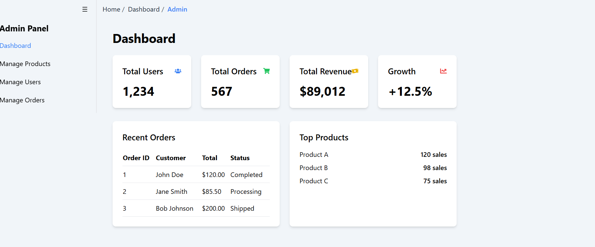
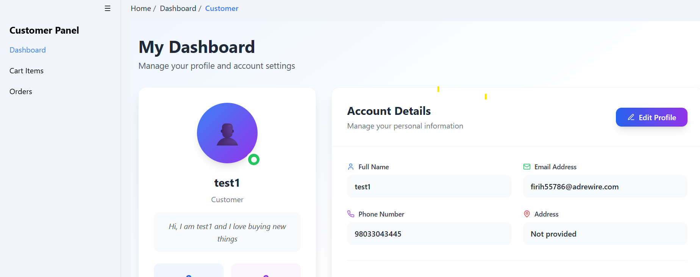
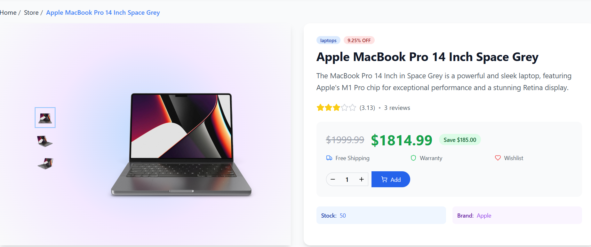
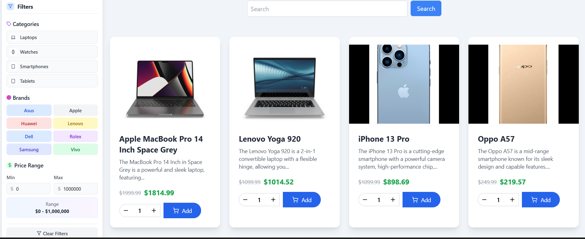

# 🛒 MERN Electronics Store

A full-featured eCommerce web application built using the **MERN Stack** (MongoDB, Express.js, React.js, and Node.js). This app includes **Admin and Customer Dashboards**, **User Authentication**, **Product Management**, **Shopping Cart**, **Checkout**, and much more.

---

## 📸 Screenshots

| Admin Panel                   | Customer Panel                 | Homepage                     |
|------------------------------|-------------------------------|------------------------------|
|  |  |  |

| Product Details Page          | Store Page (Products & Search)|
|------------------------------|-------------------------------|
|  |  |

---

## 🚀 Features

### 👤 Authentication & Authorization
- User registration and login
- Secure authentication with JWT
- Role-based access (Admin & Customer)

### 🛍️ Customer Dashboard
- Browse electronics products by category
- Product search and filter
- Add/remove items to/from cart
- View product details
- Checkout and order confirmation
- View past orders

### 🧑‍💼 Admin Dashboard
- Admin login
- Manage products (Add, Edit, Delete)
- View all orders
- Manage users
- Dashboard stats & analytics (optional)

### 💳 Shopping Cart & Checkout
- Add items to cart (local storage + DB sync)
- Update quantity or remove items
- Checkout with shipping details
- Esewa Payment Gateway Added

---

## 🛠️ Technologies Used

| Tech                 | Description                     |
|----------------------|---------------------------------|
| MongoDB              | NoSQL database for data storage |
| Express.js           | Backend framework for Node.js   |
| React.js             | Frontend library                |
| Node.js              | Backend runtime environment     |
| JWT                  | Authentication                  |
| Redux                | State management (optional)     |
| TailwindCSS / Bootstrap | Styling                      |
| Mongoose             | MongoDB ODM                     |
| dotenv               | Manage environment variables    |
